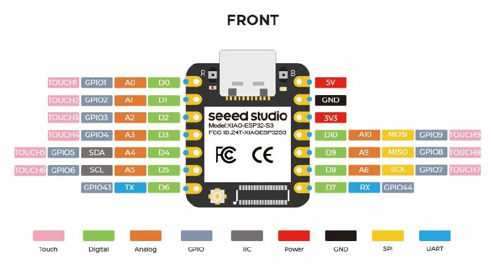

# esp32-apc-ups-mqtt

A JimGat Lab ESP32-S3 APC UPS sentinel: USB-HID UPS telemetry in, MQTT power intelligence out.

This firmware targets ESP32-S3 USB OTG boards connected to APC UPS USB HID ports. It publishes UPS status and metrics to MQTT for power-outage alerting, outage/recovery tracking, brownout monitoring, and low-voltage trend collection. It began as a clean public import and extension of [`hms-homelab/hms-esp-apc`](https://github.com/hms-homelab/hms-esp-apc), with attribution preserved but without carrying upstream local configuration history into this repo.

## JimGat fork changes

- Uses ESP-IDF/CMake, not Arduino.
- Removes compiled-in Wi-Fi and MQTT credentials.
- Stores Wi-Fi and MQTT settings in ESP32 NVS.
- Starts a first-boot/fallback provisioning AP when settings are missing or Wi-Fi connection fails.
- Keeps the upstream web configuration/status UI and saves submitted settings to NVS.

## First boot provisioning

1. Flash the firmware.
2. On first boot, connect to the Wi-Fi AP named `APC-UPS-Setup-XXXXXX`.
3. Use provisioning AP password `configureme` unless changed in `idf.py menuconfig`.
4. Open `http://192.168.4.1/`.
5. Enter Wi-Fi SSID/password, MQTT broker URL, optional MQTT username/password, and publish interval.
6. Save. The device stores settings in NVS and reboots into station mode.

No site Wi-Fi or MQTT credentials are stored in source, `sdkconfig.defaults`, or firmware defaults.


## Immediate power-event MQTT messages

The device keeps the full voltage/load/battery telemetry publish interval at the configured general status cadence, default `60` seconds. Power-state changes do not wait for that interval.

When the UPS status changes, firmware immediately publishes a compact snapshot plus an event JSON message:

| Event | Trigger |
|-------|---------|
| `power_lost` | Line power changes from online to on-battery/discharging |
| `power_restored` | UPS returns from on-battery/discharging to online |
| `low_battery` | UPS low-battery flag asserts |
| `low_battery_cleared` | UPS low-battery flag clears |

Immediate snapshot topics reuse the Home Assistant state topics for `status`, `input_voltage`, `load_percent`, `battery_charge`, `battery_runtime`, and `power_failure` when available.

Dedicated event topic:

```text
apc_ups/<device_id>/events/power
```

Example event payload:

```json
{
  "event": "power_lost",
  "device_id": "apc_ups_aabbccddeeff",
  "uptime_ms": 123456,
  "status": "On Battery",
  "online": false,
  "discharging": true,
  "low_battery": false,
  "input_voltage": 0.00,
  "battery_charge": 98.00,
  "battery_runtime_seconds": 2400,
  "load_percent": 23.00
}
```

## Browser web flasher

This repo includes a Dexter-lab themed browser flasher under `docs/`, adapted from the CYM-NM28C5 web flasher pattern. It is intended for GitHub Pages and desktop Chrome/Edge with Web Serial enabled.

Flash package layout:

| File | Offset | Purpose |
|------|--------|---------|
| `binaries-esp32s3/bootloader.bin` | `0x0` | ESP32-S3 bootloader |
| `binaries-esp32s3/partition-table.bin` | `0x8000` | Partition table |
| `binaries-esp32s3/apc_usb_mqtt_bridge.bin` | `0x10000` | Main firmware app |

Manual local use:

```bash
cd /home/dev/projects/esp32-apc-ups-mqtt
python3 -m http.server 8000
# Open http://localhost:8000/docs/ in Chrome/Edge on a machine with Web Serial access.
```

GitHub Pages deployment is handled by `.github/workflows/deploy-flasher.yml`. In GitHub, set Pages source to **GitHub Actions**.

## Upstream README

# hms-esp-apc

[](https://buymeacoffee.com/wjvasxixlg)

ESP32-S3 USB Host to MQTT bridge for APC UPS with Home Assistant auto-discovery.

Reads real-time metrics from an APC Back-UPS over USB HID and publishes them to an MQTT broker. Home Assistant discovers the UPS automatically — no YAML configuration required.

## Features

- USB HID host communication with APC Back-UPS (no apcupsd/NUT required)
- MQTT publishing with Home Assistant MQTT auto-discovery
- Unique device ID per bridge (based on ESP32 MAC address)
- 30+ sensor entities: battery, input power, load, status, timers, and more
- Automatic reconnection for both WiFi and MQTT
- Fallback to simulated data when no USB device is connected (for development)
- 10-second boot delay window for reflashing

## Supported Hardware

- **Microcontroller**: ESP32-S3 with USB OTG (e.g., M5Stack AtomS3, ESP32-S3-DevKitC)
- **UPS**: APC UPS (USB VID `051D`, PID `0002` Back-UPS or `0003` Smart-UPS) — tested with Back-UPS XS 1000M, Smart-UPS C 1500
- **USB Connection**: USB OTG on GPIO19 (D-) / GPIO20 (D+)

### Wiring

Connect the APC UPS USB port to the ESP32-S3 USB OTG pins:

| UPS USB | ESP32-S3 |
|---------|----------|
| D- (white) | GPIO19 |
| D+ (green) | GPIO20 |
| VCC (red) | 5V |
| GND (black) | GND |

> **Note**: Most ESP32-S3 dev boards expose the USB OTG pins on a dedicated connector. If your board uses the USB OTG port for programming (USB-CDC), you may need a USB hub or OTG adapter.


### Seeed Studio XIAO ESP32-S3 USB host wiring kit

The Seeed Studio XIAO ESP32-S3 is a suitable target for this firmware because its USB-C connector is wired to the ESP32-S3 native USB-OTG peripheral. Use the XIAO USB-C port for UPS data/host mode; do **not** connect the UPS USB data wires to arbitrary XIAO GPIO header pins.

For a compact XIAO install, the preferred cabling pattern is a USB-C OTG adapter with a power-injection/charging port. Power the XIAO from a charger plugged into a battery-backed UPS outlet, while the UPS USB cable connects to the adapter's USB-A data port.

| Ordered item | Amazon link | Role in the build |
|--------------|-------------|-------------------|
| Antrader 1-foot Mini USB 2.0 A-male to Mini-B cables, pack of 6 | https://a.co/d/0dLqaXXz | Short data cable from APC UPS USB Mini-B management port to the OTG adapter USB-A port. If a UPS has a full-size USB-B port instead of Mini-B, use the matching USB-A to USB-B cable instead. |
| 20W USB-C wall chargers, 4-pack | https://a.co/d/02OFik4w | Dedicated 5V power source for each XIAO bridge. Plug into a battery-backed UPS outlet so the bridge remains alive during line-power loss. |
| 6-inch USB-C to USB-C cables, 4-pack | https://a.co/d/0bIzk3fL | Short power lead from the USB-C charger to the OTG adapter charging/power-injection port. |
| AreMe 2-in-1 USB-C to USB 3.2 OTG adapter with 100W charging port | https://a.co/d/0dhfkRnu | Lets the XIAO use its USB-C port as the USB host connection to the UPS while also receiving external USB-C power. |

Recommended physical wiring:

```text
UPS battery-backed AC outlet
        │
        ▼
20W USB-C wall charger
        │
        ▼
6-inch USB-C cable
        │
        ▼
OTG adapter charging / power-injection port
        │
        ▼
XIAO ESP32-S3 USB-C port  ── USB host/data ── OTG adapter USB-A port
                                                 │
                                                 ▼
                                      USB-A to Mini-B cable
                                                 │
                                                 ▼
                                      APC UPS USB management port
```

Electrical notes:

- USB host data uses ESP32-S3 native USB `GPIO19` (`D-`) and `GPIO20` (`D+`), which are already routed to the XIAO USB-C connector.
- The XIAO edge-header pins `D0`-`D10` are general GPIO/ADC/SPI/I2C/UART pins, not alternate USB host data pins.
- Avoid powering the XIAO from the UPS USB management port alone; the bridge should have a stable 5V source that remains powered on battery.
- If powering through the XIAO `5V` pin instead of USB-C, follow Seeed's guidance and use diode isolation to avoid backfeeding USB power rails.
- Keep any hand-wired USB `D+`/`D-` runs short and paired; prefer the USB-C/OTG adapter path for the first prototype.

First validation target in the serial log:

```text
APC UPS found! VID:PID = 051D:0002
```

or:

```text
APC UPS found! VID:PID = 051D:0003
```

### XIAO ESP32-S3 TTL serial debug wiring



When the XIAO USB-C port is being used as the USB host connection to the UPS, use the exposed UART pins for serial monitoring instead of relying on USB-CDC through the same USB-C connector.

The firmware logs through ESP-IDF `ESP_LOG*()` calls, and this project defaults the ESP-IDF console to UART0 at `115200` baud.

| XIAO ESP32-S3 pin | ESP32-S3 GPIO | UART signal | TTL adapter connection |
|-------------------|---------------|-------------|------------------------|
| `D6` | `GPIO43` | UART0 TX | Adapter RX |
| `D7` | `GPIO44` | UART0 RX | Adapter TX, optional unless sending input |
| `GND` | Ground | Ground reference | Adapter GND |

Serial settings:

```text
115200 baud, 8 data bits, no parity, 1 stop bit
```

Important notes:

- Use a **3.3V TTL** serial adapter, not RS-232 levels.
- Do not connect the adapter's 5V output to the XIAO when the XIAO is already powered through the USB-C OTG/power adapter.
- For receive-only logging, `D6`/`GPIO43` TX to adapter RX plus common ground is enough.
- Connect adapter TX to `D7`/`GPIO44` RX only if interactive console input is needed.

## Prerequisites

- [ESP-IDF](https://docs.espressif.com/projects/esp-idf/en/stable/esp32s3/get-started/) v5.3 or later
- An MQTT broker (e.g., Mosquitto)
- Home Assistant with MQTT integration enabled

## Build & Flash

```bash
# Clone the repository
git clone https://github.com/JimGat/esp32-apc-ups-mqtt.git
cd esp32-apc-ups-mqtt

# Build. Do not put site Wi-Fi/MQTT credentials in source or sdkconfig.
idf.py build

# Flash (replace PORT with your serial port)
idf.py -p PORT flash

# Monitor serial output
idf.py -p PORT monitor
```

## Configuration

Wi-Fi and MQTT settings are provisioned at runtime and stored in NVS, not hard-coded into source or sdkconfig.

On first boot, or when the configured Wi-Fi cannot be reached, the device starts a setup AP named `APC-UPS-Setup-XXXXXX`. Connect to it and browse to `http://192.168.4.1/` to save:

| Setting | Storage | Description |
|---------|---------|-------------|
| WiFi SSID | NVS | Wi-Fi network name |
| WiFi Password | NVS | Wi-Fi password |
| MQTT Broker URL | NVS | MQTT broker address, e.g. `mqtt://192.168.1.100` |
| MQTT Username | NVS | MQTT username, optional |
| MQTT Password | NVS | MQTT password, optional |
| Publish Interval | NVS | How often to publish metrics to MQTT |

Build-time menuconfig only controls non-site defaults:

| Setting | Default | Description |
|---------|---------|-------------|
| Provisioning AP Prefix | `APC-UPS-Setup` | First-boot/fallback setup AP SSID prefix |
| Provisioning AP Password | `configureme` | Temporary setup AP password; change for production images if desired |
| UPS Poll Interval | `5000` ms | How often to poll feature reports from the UPS |
| MQTT Publish Interval | `60000` ms | Initial publish interval before provisioning overrides it |

## Home Assistant Entities

Once running, the following sensors appear automatically in Home Assistant under a device named **APC UPS (MAC)**:

### Battery
| Entity | Unit | Description |
|--------|------|-------------|
| Battery Charge | % | Current battery charge level |
| Battery Voltage | V | Current battery voltage |
| Battery Nominal Voltage | V | Configured battery voltage (e.g., 12V) |
| Battery Runtime | s | Estimated runtime on battery |
| Battery Low Runtime | s | Low runtime threshold |
| Battery Low Charge | % | Low charge threshold |
| Battery Warning Charge | % | Warning charge threshold |
| Battery Type | — | Chemistry (e.g., PbAc) |
| Battery Manufacture Date | — | Battery manufacture date |

### Input Power
| Entity | Unit | Description |
|--------|------|-------------|
| Input Voltage | V | Current input (mains) voltage |
| Input Nominal Voltage | V | Configured nominal voltage (e.g., 120V) |
| Low Voltage Transfer | V | Switch-to-battery below this voltage |
| High Voltage Transfer | V | Switch-to-battery above this voltage |
| Input Sensitivity | — | Sensitivity setting (low/medium/high) |
| Last Transfer Reason | — | Why the UPS last switched to battery |

### Output / Load
| Entity | Unit | Description |
|--------|------|-------------|
| Load | % | Current load as percentage of capacity |
| Nominal Power | W | Rated power capacity (e.g., 600W) |

### Status & Timers
| Entity | Unit | Description |
|--------|------|-------------|
| UPS Status | — | OL (online), OB (on battery), CHRG, LB, etc. |
| Beeper Status | — | enabled / disabled / muted |
| Reboot Delay | s | Configured delay before reboot |
| Reboot Timer | s | Active reboot countdown (-1 = inactive) |
| Shutdown Timer | s | Active shutdown countdown (-1 = inactive) |
| Self-Test Result | — | Last self-test outcome |

### Device Info
| Entity | Description |
|--------|-------------|
| Driver Name | `esp32-usb-hid` |
| Driver Version | Driver version string |
| Driver State | `running` |
| Power Failure | `OK` or failure reason |

## Architecture

The firmware runs four FreeRTOS tasks:

1. **USB Host Task** — Manages the USB host stack, receives interrupt transfers (automatic status updates from UPS), and polls feature reports (voltage, load, thresholds) on a configurable interval.

2. **MQTT Publish Task** — Publishes Home Assistant MQTT discovery configs on startup, then periodically reads the shared metrics struct and publishes all sensor values.

3. **WiFi Manager** — Handles WiFi STA connection with automatic reconnection on disconnect.

4. **Main / app_main** — Initializes NVS, WiFi, MQTT, and USB host. Creates all tasks and enters idle.

### Data Flow

```
APC UPS (USB Device)
  |
  | USB HID Reports (interrupt + feature)
  v
USB Host Manager ──> APC HID Parser ──> ups_metrics_t (shared struct)
                                              |
                                              v
                                    MQTT Publish Task ──> MQTT Broker ──> Home Assistant
```

## Known Hardware Limitations

- **Input frequency**: The APC Back-UPS XS 1000M reports 0 Hz for input frequency — this appears to be a hardware limitation.
- **Output voltage**: Line-interactive UPS models do not measure output voltage separately; it mirrors input voltage.
- **Firmware version**: Not available via HID reports on this UPS model.
- **Battery date encoding**: The manufacture date is reported as a raw day count; decoding varies by model.

## Contributing

Contributions are welcome! Please open an issue or pull request.

1. Fork the repository
2. Create a feature branch (`git checkout -b feature/my-change`)
3. Commit your changes
4. Push to the branch and open a Pull Request
---

## ☕ Support

If this project is useful to you, consider buying me a coffee!

[](https://buymeacoffee.com/wjvasxixlg)

## License

This project is licensed under the MIT License — see the [LICENSE](LICENSE) file for details.
